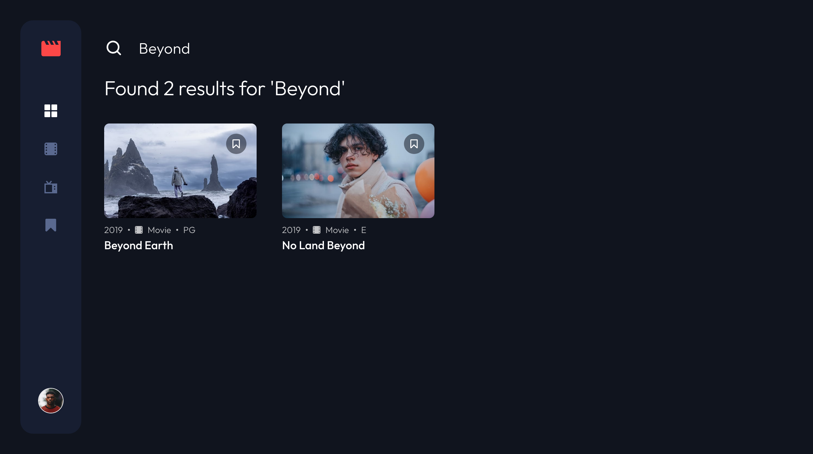

# Entertainment Web App

A full-stack application for discovering and bookmarking shows.

## Table of contents

- [Overview](#overview)
  - [The challenge](#the-challenge)
  - [Screenshot](#screenshot)
  - [Links](#links)
- [My process](#my-process)
  - [Built with](#built-with)
- [Acknowledgments](#acknowledgments)

## Overview

### The challenge

Users should be able to:

- View the optimal layout for the app depending on their device's screen size
- See hover states for all interactive elements on the page
- Navigate between Home, Movies, TV Series, and Bookmarked Shows pages
- Add/Remove bookmarks from all movies and TV series
- Search for relevant shows on all pages

### Screenshot

### Links

- [Solution](https://your-solution-url.com)
- [Live Site](https://your-live-site-url.com)
- [Backend repo](https://github.com/grenzk/entertainment-web-app-backend)

## My process

### Built with

- Semantic HTML5 markup
- CSS custom properties
- Flexbox
- CSS Grid
- Mobile-first workflow
- SASS
- Vue (frontend)
- Quasar
- Ruby on Rails (backend)

## Acknowledgments

This project was inspired by the [Entertainment web app challenge on Frontend Mentor](https://www.frontendmentor.io/challenges/entertainment-web-app-J-UhgAW1X). Frontend Mentor challenges provide valuable opportunities to enhance coding skills by working on realistic projects.
