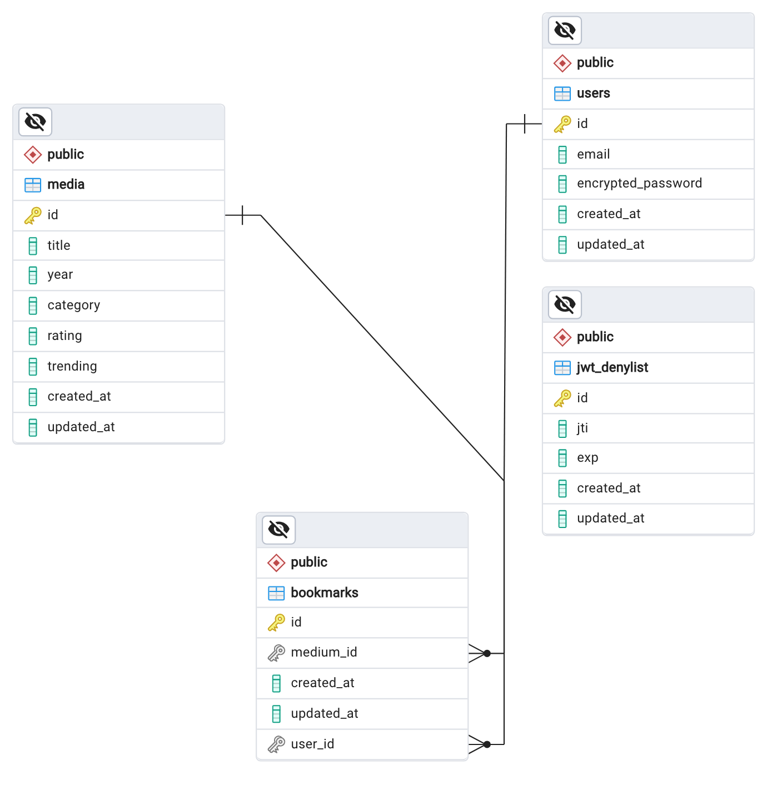

# Entertainment Web App

A full-stack application for discovering and bookmarking shows.

## Table of contents

- [Overview](#overview)
  - [The challenge](#the-challenge)
  - [Screenshot](#screenshot)
  - [Links](#links)
- [My process](#my-process)
  - [Built with](#built-with)
- [Usage](#usage)
  - [Development](#development)
- [Acknowledgments](#acknowledgments)

## Overview

### The challenge

Users should be able to:

- View the optimal layout for the app depending on their device's screen size
- See hover states for all interactive elements on the page
- Navigate between Home, Movies, TV Series, and Bookmarked Shows pages
- Add/Remove bookmarks from all movies and TV series
- Search for relevant shows on all pages

### Screenshot


### Links

- [Solution](https://github.com/grenzk/entertainment-web-app)
- [Live Site](https://entertainment-web-app-navy.vercel.app)
- [Backend repo](https://github.com/grenzk/entertainment-web-app-backend)

## My process

### Built with

#### Frontend

- Semantic HTML5 markup
- CSS custom properties
- Flexbox
- CSS Grid
- Mobile-first workflow
- SASS
- Vue
- Vue Router
- Quasar (Vue framework/component library)
- Axios (HTTP requests and data handling)
- Pinia (State management)
- VeeValidate with Yup (Form validation stack)

#### Backend

- Ruby on Rails
- PostgreSQL
- Devise with Devise-jwt (Authentication)

##### ERD



## Usage

### Test User Account

|         Email          | Password |
| :--------------------: | :------: |
| `john.doe@example.com` |  foobar  |

### Development

#### Inside the Vue project

Create a `.env.local` file and add

```
VITE_BASE_URL=http://localhost:3000
```

then run the project

```
npm install
npm run dev
```

#### Inside the Ruby on Rails project

Create a database and seed data

```
bin/rails db:create db:migrate db:seed
```

then run the project

```
bin/rails s
```

## Acknowledgments

This project was inspired by the [Entertainment web app challenge on Frontend Mentor](https://www.frontendmentor.io/challenges/entertainment-web-app-J-UhgAW1X). Frontend Mentor challenges provide valuable opportunities to enhance coding skills by working on realistic projects.
